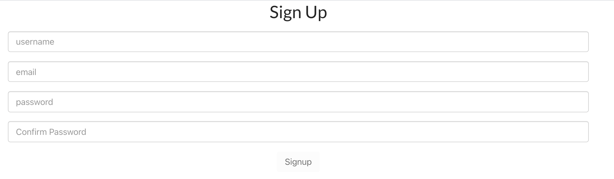
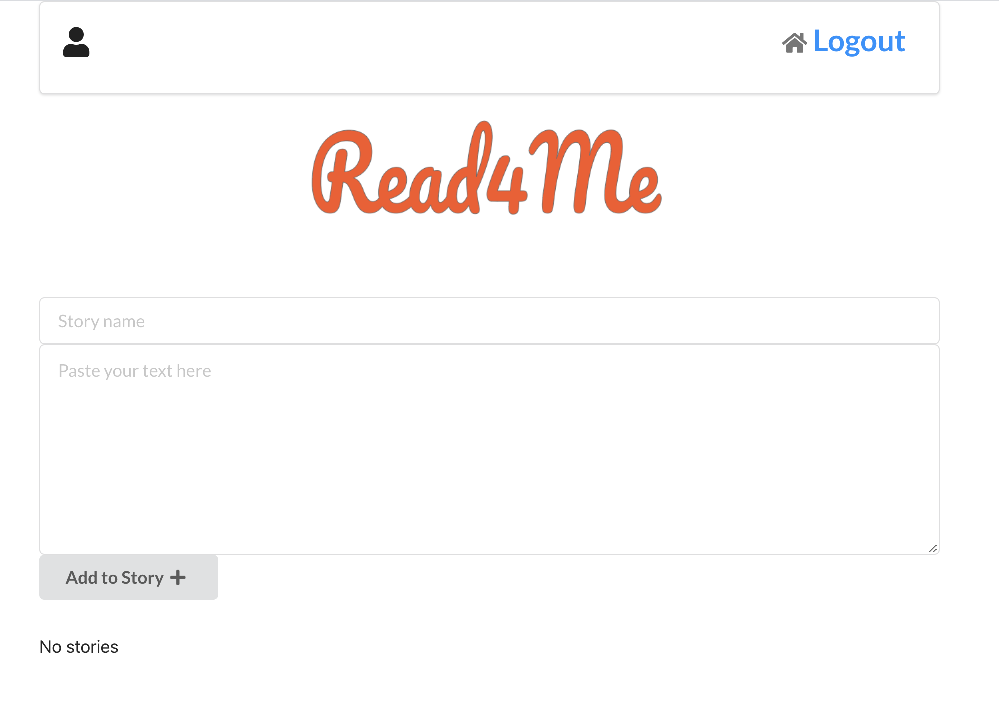
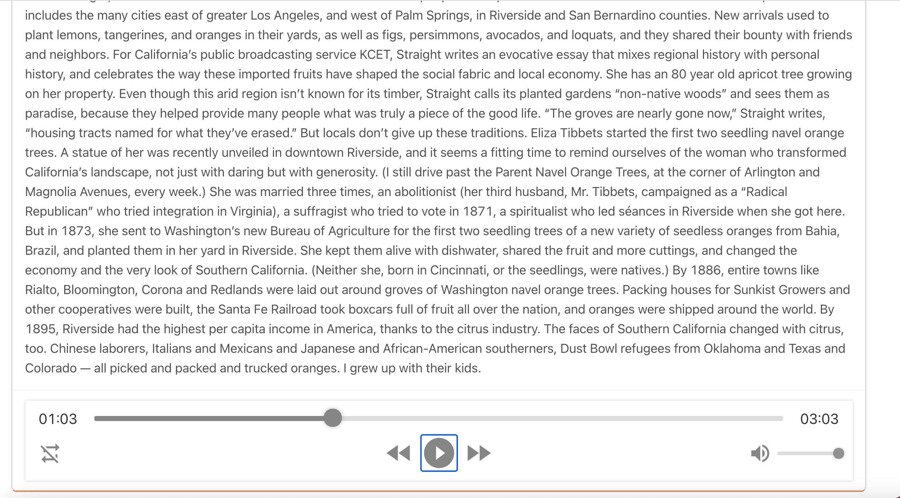

# Read4Me
==================

As a part of SEI-10-19 Project 4, I created **Read4Me**.

This is a simple full-stack web app synthesizing any text in 40+ languages utilizing 220+ voices. 

**Mission**

To improve a time management and give a great tool to make life better.

**Problems**

* You have a lot of documents to read. 
* You don't have time for interesting long-read material but eager to know about it.
* You want to learn a new language 
 

1. ## Screenshots

2. ## Technologies Used
* Node.JS
* Express
* Mongoose
* Heroku
* Atlas
* MongoDB
* Google API
* AWS S3

3. ## Link to deployed app:
Please see the project here [Read4Me](https://read4me.herokuapp.com)

4. ## Ice-BOX: 

* User should be able to choose languages or different voice for each story;
* User should be able to see a playing text as a WATERFALL while listening the story
* User should be able to see diagrams or photo from the document that currently playing 
* User should be able to arrange stories in the queue
